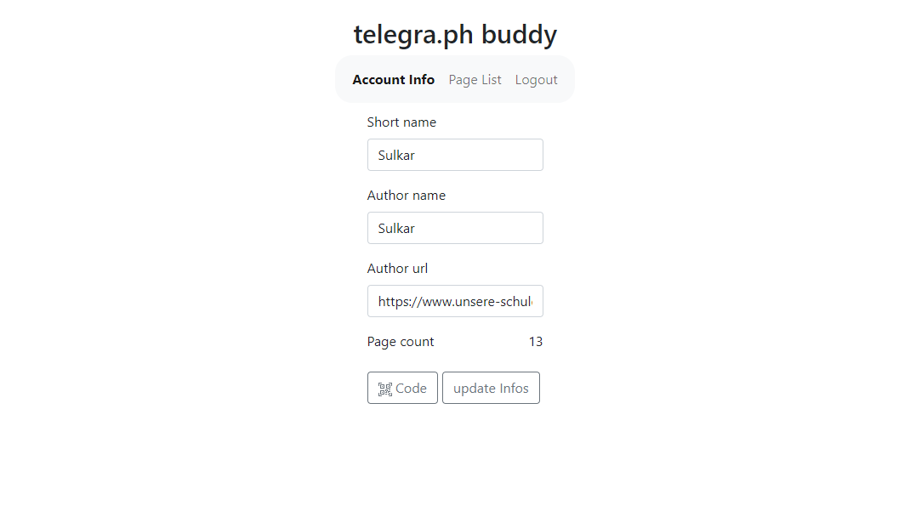
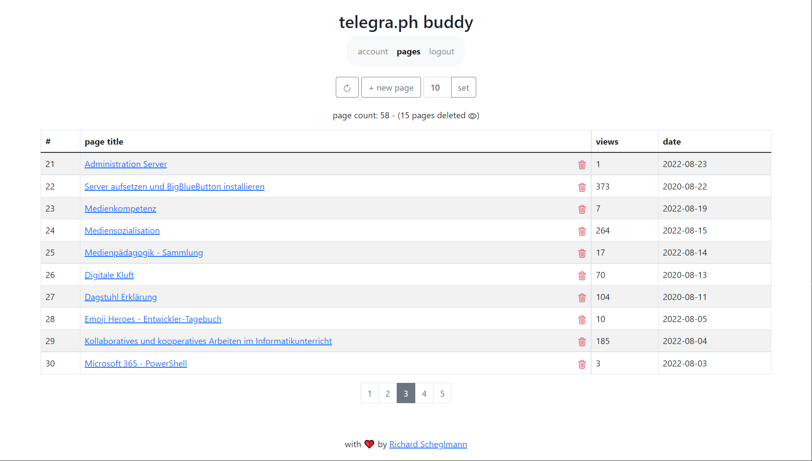
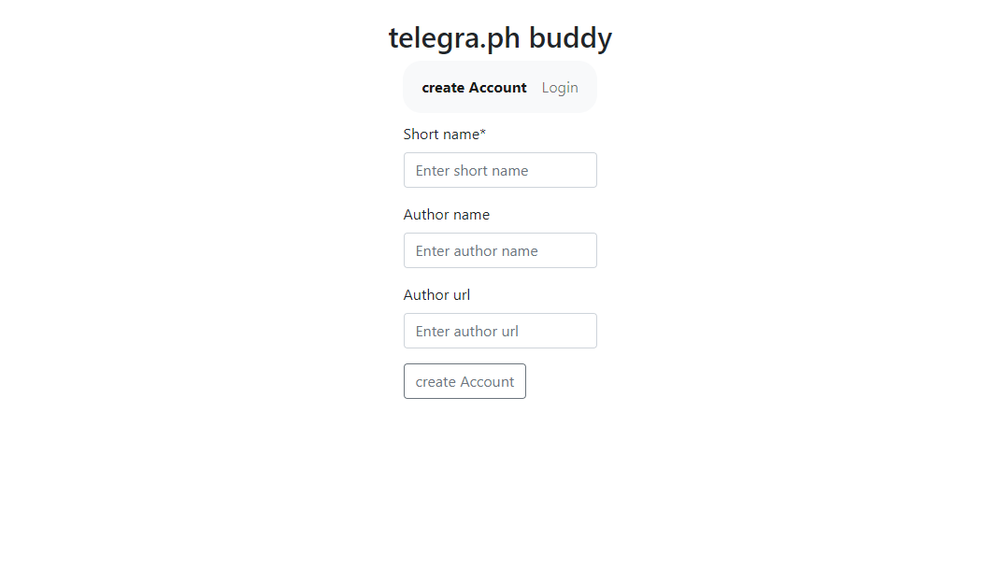

# telegra.ph-buddy
A simple website to manage your [telegra.ph](https://telegra.ph/) posts and accounts.

To quickly write and publish posts and manage them using anonymous accounts.

# Demo:
[telegraph-buddy](https://telegraph-buddy.unsere-schule.org/)

# Features:
- Create a new telegra.ph account.
- Save generated QR-Code with auth_token for simple login.
- Log in to telegra.ph using your auth_token or QR-Code.
- View a list of your posts with corresponding view stats.
- Edit posts and create new one.
- Order pages.
- **Pseudo DELETE pages.**
- Add custom [] codes, that are used in telegraph-buddy:
  - [date=2022-04-01] displays correct date with year, month and day.

Want to download your telegra.ph post as HTML files and images with image lightbox option? Try [telegra.ph-scraper](https://github.com/Sulkar/telegra.ph-scraper)
# Images:

